# Opus 5.5 website rebuilds

Seven websites rebuilt in plain HTML, CSS and JavaScript from a screen recording.

## Credit

The original sites come from the YouTube video
[NEW Opus 5.5 is INSANE at Building Websites (Full Showcase)](https://www.youtube.com/watch?v=mPiaap4zEVk)
by **Brendan Jowett** ([@brendanautomation](https://www.youtube.com/@brendanautomation)).
In that video, Claude Opus 5.5 builds seven sites from scratch. The designs, layouts,
animations and brand names are from that video. This repository is not affiliated with
Brendan Jowett or Anthropic.

## Live sites

All seven sites run on GitHub Pages. Click a picture to open the live page.

| Site | Live page | Notes |
|---|---|---|
| [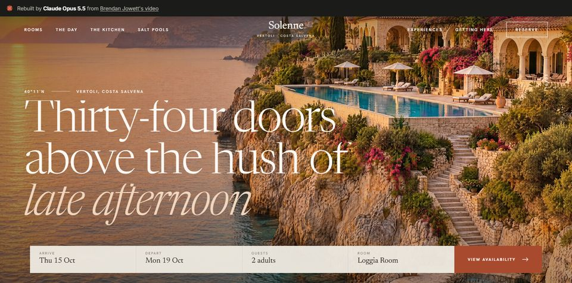](https://az9713.github.io/opus55-website-rebuilds/sites/1-hotel/) | [Solenne, cliffside hotel](https://az9713.github.io/opus55-website-rebuilds/sites/1-hotel/) | room carousel, day-cycle clock, booking calendar |
| [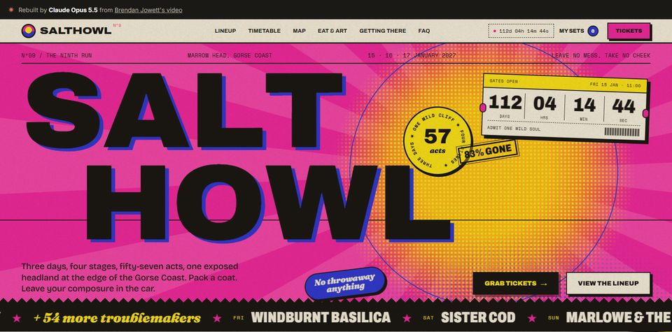](https://az9713.github.io/opus55-website-rebuilds/sites/2-festival/) | [SALTHOWL, music festival](https://az9713.github.io/opus55-website-rebuilds/sites/2-festival/) | timetable with clash detection, festival map |
| [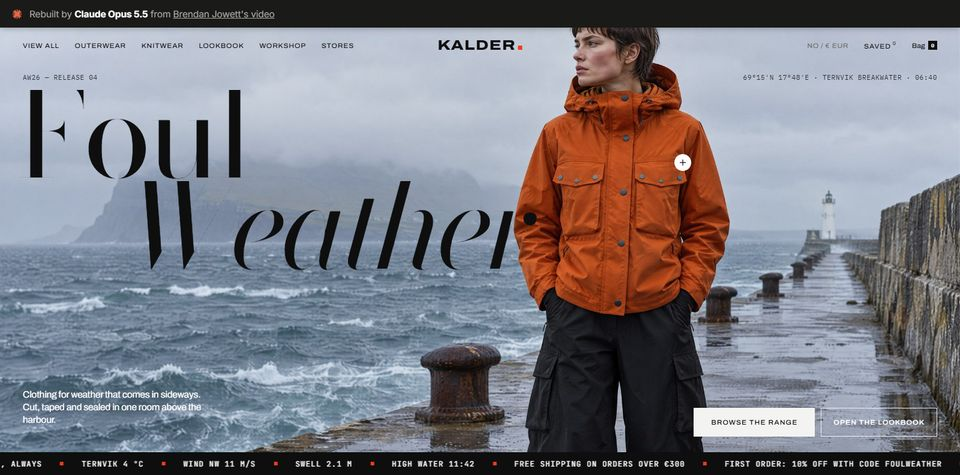](https://az9713.github.io/opus55-website-rebuilds/sites/3-ecommerce/) | [KALDER, clothing brand](https://az9713.github.io/opus55-website-rebuilds/sites/3-ecommerce/) | pinned lookbook with hotspots, shipping map |
| [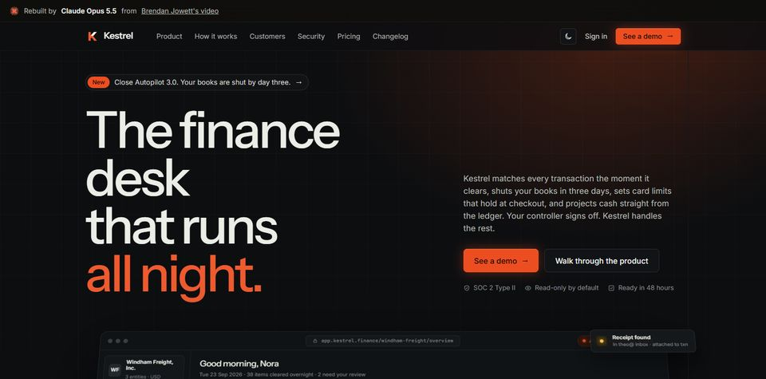](https://az9713.github.io/opus55-website-rebuilds/sites/4-saas/) | [Kestrel, finance SaaS](https://az9713.github.io/opus55-website-rebuilds/sites/4-saas/) | live coded dashboard, ROI calculator |
| [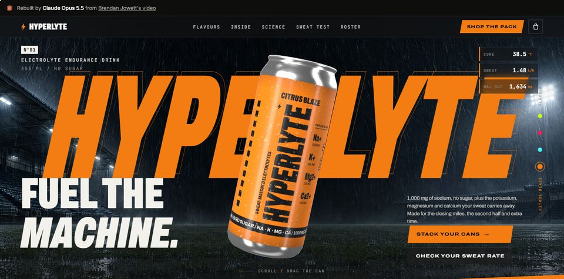](https://az9713.github.io/opus55-website-rebuilds/sites/5-drink/) | [HYPERLYTE, sports drink](https://az9713.github.io/opus55-website-rebuilds/sites/5-drink/) | three.js can built in code |
| [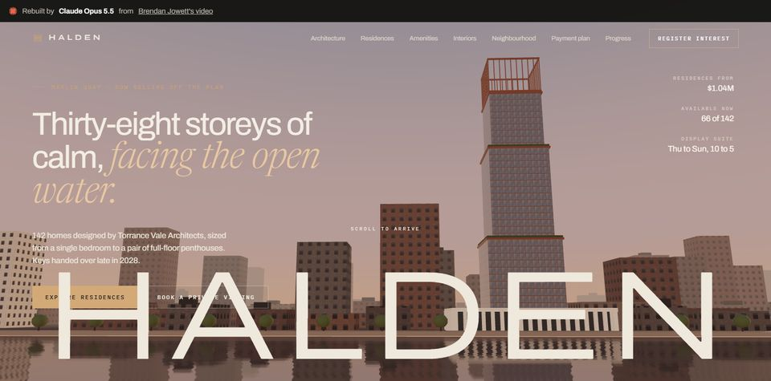](https://az9713.github.io/opus55-website-rebuilds/sites/6-highrise/) | [HALDEN, residential tower](https://az9713.github.io/opus55-website-rebuilds/sites/6-highrise/) | procedural three.js tower and city |
| [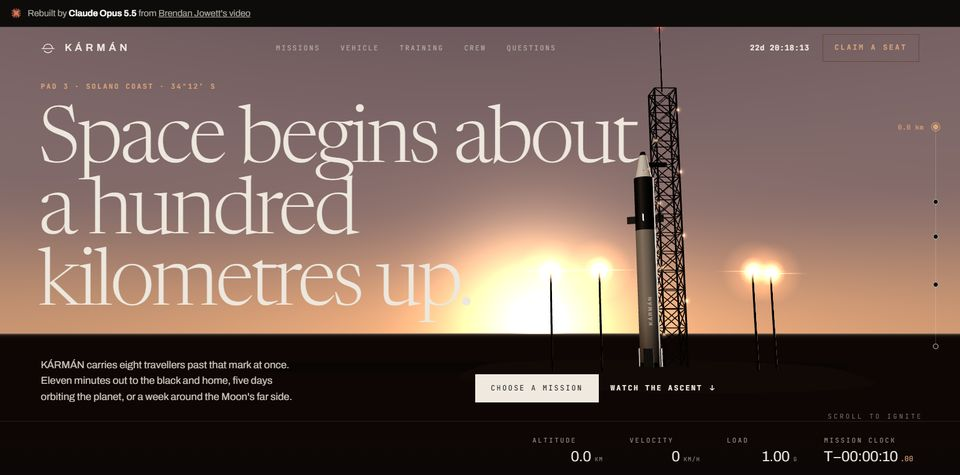](https://az9713.github.io/opus55-website-rebuilds/sites/7-space/) | [KÁRMÁN, space tourism](https://az9713.github.io/opus55-website-rebuilds/sites/7-space/) | procedural rocket, Earth shader, Moon pass |

The 3D sites (5, 6, 7) need WebGL. Use a desktop browser for the full effect.

## Stage 2: seven new sites in the same styles

Each new site keeps the layout, fonts, animations and tone of one rebuilt site. The subject,
place, copy, palette and all images are new. The seven subjects were chosen to differ from the
originals and from each other: seven climates, six regions. Sources are in `sites-v2/`.

| Site | Page | Style of | Notes |
|---|---|---|---|
| [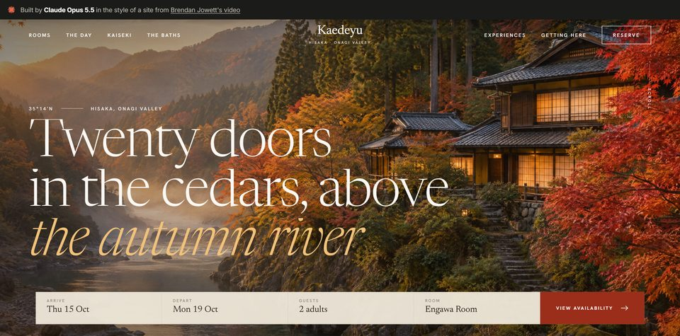](https://az9713.github.io/opus55-website-rebuilds/sites-v2/1-hotel/) | [Kaedeyu, mountain ryokan in autumn](https://az9713.github.io/opus55-website-rebuilds/sites-v2/1-hotel/) | Solenne | same booking, day clock and map; river instead of sea |
| [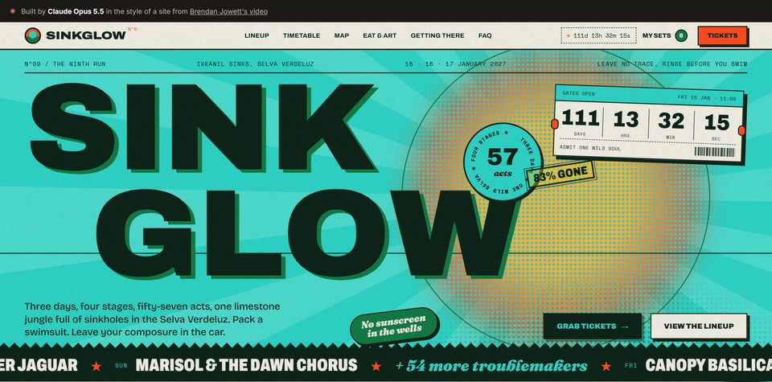](https://az9713.github.io/opus55-website-rebuilds/sites-v2/2-festival/) | [SINKGLOW Nº9, jungle cenote festival](https://az9713.github.io/opus55-website-rebuilds/sites-v2/2-festival/) | SALTHOWL | timetable, picks, map with cenotes |
| [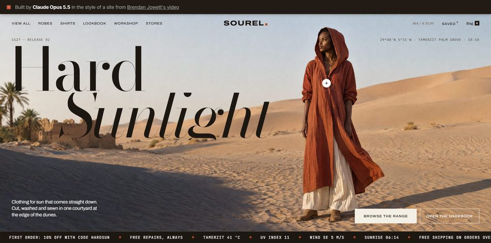](https://az9713.github.io/opus55-website-rebuilds/sites-v2/3-ecommerce/) | [SOUREL, desert sun-wear](https://az9713.github.io/opus55-website-rebuilds/sites-v2/3-ecommerce/) | KALDER | lookbook hotspots, filters, store map re-projected |
| [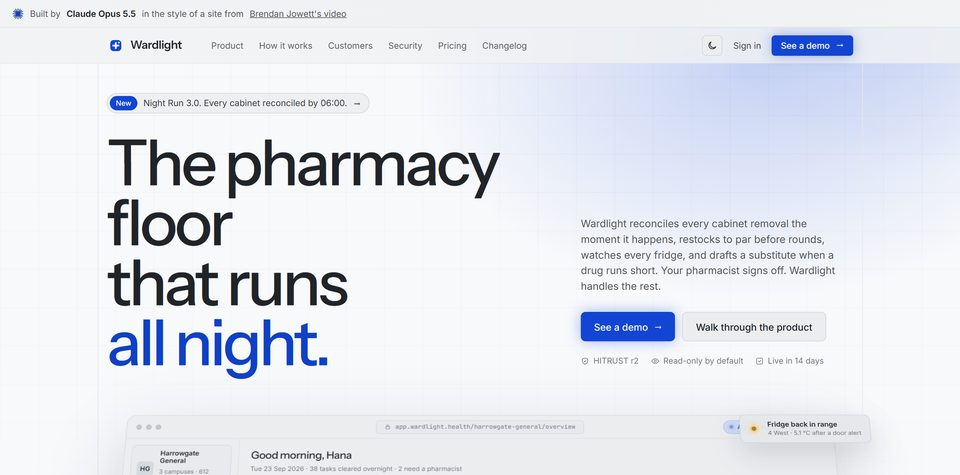](https://az9713.github.io/opus55-website-rebuilds/sites-v2/4-saas/) | [Wardlight, overnight hospital pharmacy](https://az9713.github.io/opus55-website-rebuilds/sites-v2/4-saas/) | Kestrel | shortage forecast, night-run checklist, ROI |
| [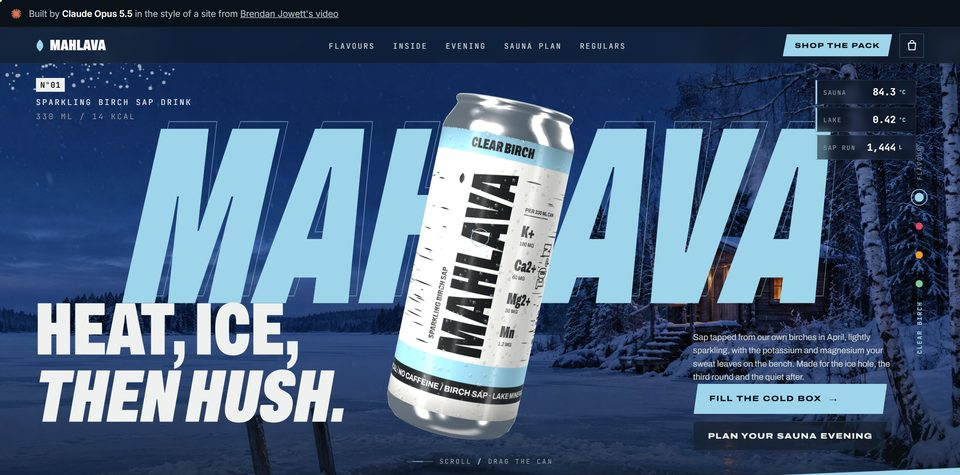](https://az9713.github.io/opus55-website-rebuilds/sites-v2/5-drink/) | [MAHLAVA, birch-sap sauna drink](https://az9713.github.io/opus55-website-rebuilds/sites-v2/5-drink/) | HYPERLYTE | 3D can with new code-drawn label, sauna calculator |
| [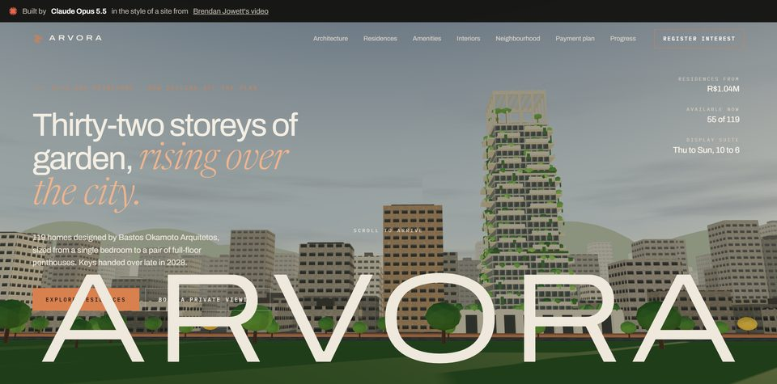](https://az9713.github.io/opus55-website-rebuilds/sites-v2/6-highrise/) | [ARVORA, garden tower in a dense city](https://az9713.github.io/opus55-website-rebuilds/sites-v2/6-highrise/) | HALDEN | 3D concrete tower with 112 planted balconies, city instead of water |
| [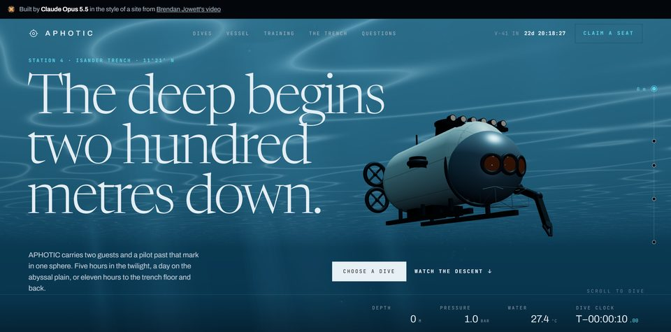](https://az9713.github.io/opus55-website-rebuilds/sites-v2/7-space/) | [APHOTIC, deep-sea trench dives](https://az9713.github.io/opus55-website-rebuilds/sites-v2/7-space/) | KÁRMÁN | 3D submersible built in code, dive to 9,412 m |

## How the rebuild was done

[Development journey](https://az9713.github.io/opus55-website-rebuilds/DEVELOPMENT-JOURNEY.html)
tells, step by step, how Claude Opus 5.5 "watched" the video and rebuilt the sites:
frames, animations, images, what was not rebuilt, and what went wrong.

## Run locally

Open any `sites/<N-name>/index.html` or `sites-v2/<N-name>/index.html` in a browser. There is no build step.
The pages load Google Fonts and scripts from cdnjs / jsDelivr.

## How it was made

1. Claude Opus 5.5 agents rebuilt each site from video frames, one agent per site.
   `BRIEF.md` is the brief they followed.
2. At first the photos were cropped from the video. All 75 photos were then replaced
   with new images generated from text prompts (GPT Image 2.5 through Higgsfield).
   No photo in `sites/*/img/` comes from the video.
3. The page text was first copied from the video. It was then rewritten in new words.
   Only the seven brand names are kept.
4. The top banner of each page links to the source video. The original banners showed
   the build time and API cost of the original build. Those numbers are removed,
   because they do not describe these rebuilds.

## Scripts

- `scripts/shot.py <html> <outdir> [scrollY ...]` takes Chrome screenshots (Playwright)
  and prints the page height and JS errors.
- `scripts/evidence.py` and `scripts/evidence_page.py` build a comparison report:
  video frame against rebuild, with and without the photos.
- `scripts/cmp.py` and `scripts/sheets.py` need video frames, which are not in this repository.

MIT License. See [LICENSE](LICENSE).
